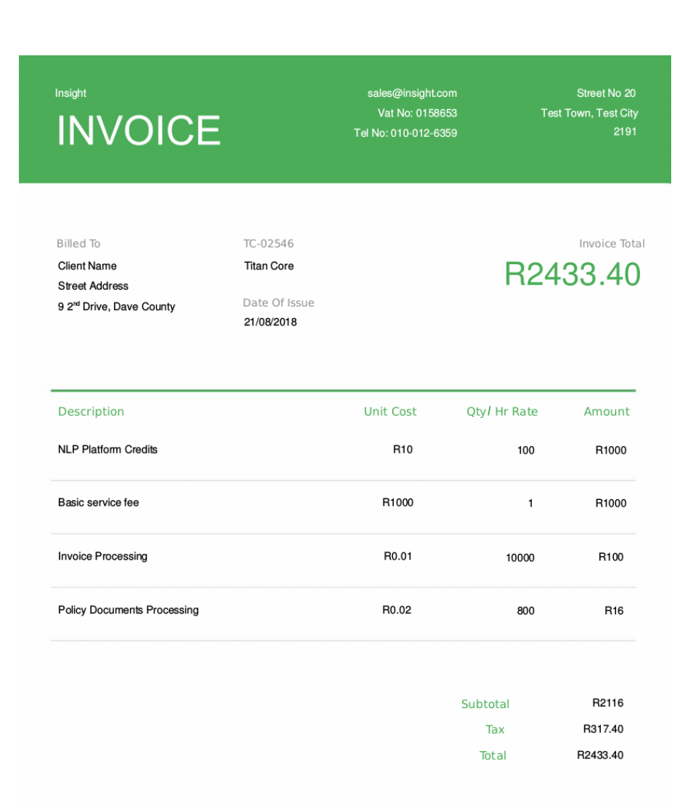

# PDF Text Miner
This Python application is capable of processing an invoice file and extracting text from it. The output returned is in standard json format (RFC 8259). At the time of writing, this module supports single page pdf files.

Example use-cases of such an application will be in data-connectors for businesses intending to build data warehouses or analytics capabilities from data in their current paper based solutions. 

This module extracts the following information from invoices: 
* Billed By
    * Address
    * Name
    * Vat No
    * Tel No

* Billed To
    * Address
    * Account No
    * Name

* Invoice
    * Billed Items
    * Date Invoiced
    * Invoice total   
    * VAT Percentage

An example format of invoices that can be processed by this application looks like:


## Dependencies and running program

### Installing dependency libraries:
1. Install Cmake <br/>
2. Install Visual studio 15 or 17 with C++ compiler <br/>
3. Install ImageMagick 6.9.x.x (Don't install version 7.x.x as it is not compatible with wand) ImageMagic 7.xxx will not work for wand. <br/>
4. Open terminal or cmd and run ```pip install requirements.txt``` to install the dependencies of the application.<br/>

### To Test the Pdf Mining Module, USE: 
i. Put files `sample_invoice.pdf` and `testminePdf.py` in the same working directory. <br/>
ii. Run `python testminePdf.py` in your terminal to execute the test program.<br/>
iii. Collect JSON script fron same folder or check the output printed in the console. <br/>

Running the test script against file `sample_invoice.pdf` produces the output below: 
```
{
    "Seller Email": "sales@insightcom",
    "Vat-No": "0158653",
    "Seller address": "Test Town, Test City",
    "Tel#": "010-012-6359",
    "Buyer's Address": "9 2\u2122 Drive, Dave County",
    "Buyer's Name": "Titan Core",
    "Buyer's Account": "TC-07546",
    "Date of purchase": "21/08/2018",
    "Total Price": "2433.40",
    "Item's Billed": [
        {
            "Item":"NLP Platform Credits",
            "UnitCost":"R10",
            "Rate":10,
            "Amount":"R1000"
        }, 
                {
            "Item":"Basic service fee",
            "UnitCost":"R1000",
            "Rate":1,
            "Amount":"R1000"
        },
                        {
            "Item":"Invoice Processing"",
            "UnitCost":"R0.01",
            "Rate":10000,
            "Amount":"R100"
        },                {
            "Item":"Policy Documents Processing",
            "UnitCost":"R0.02",
            "Rate":800,
            "Amount":"R16"
        }
    ]
}
```

In future work, this algorithm will be enhanced to be capable of extracting text from multi-page PDF files. The envisioned algorithm will first convert the multi-page PDF into singled page multiple PDFs for text extraction, before aggregating the results from all extraction into a single result.
